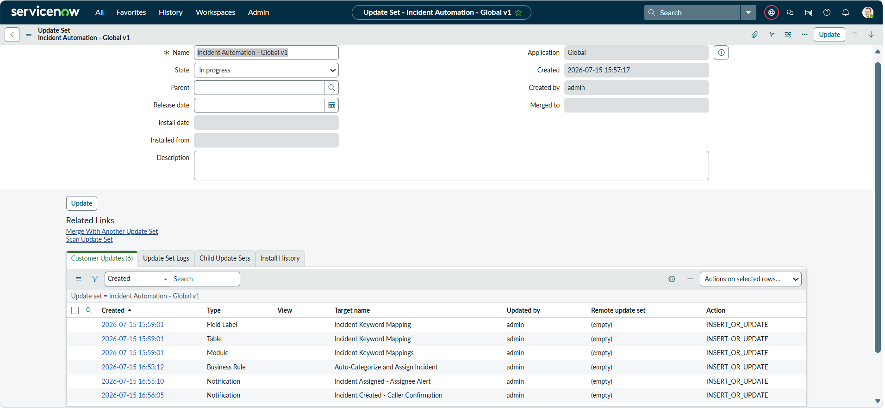
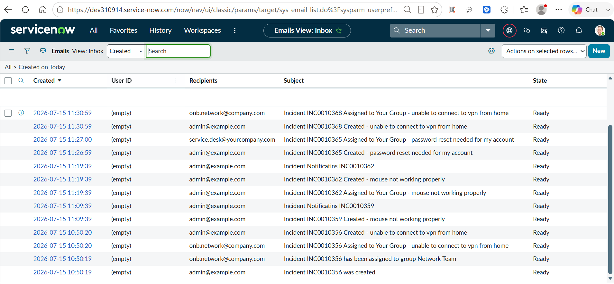

# ServiceNow Incident Automation System

A rule-based automation layer built on top of the out-of-box ServiceNow **Incident** table that automatically categorizes, routes, and notifies stakeholders for incoming incidents — removing manual triage for common, recognizable request types.

Built on a Personal Developer Instance (PDI) as a hands-on learning project to practice table design, Business Rule scripting, and notification configuration in a realistic ITSM scenario.

---

## Problem Statement

New incidents typically land with `category`, `subcategory`, and `assignment_group` all empty, requiring a human triager to read the description, decide where it belongs, and manually route it — a slow, inconsistent, and easily delayed step for high-volume, repetitive request types (password resets, VPN issues, hardware faults, etc.).

This project automates that first-touch triage step end-to-end:

1. **Auto-categorization** — incidents are tagged with the correct `category` and `subcategory` based on keywords in the short description
2. **Auto-assignment** — incidents are routed to the correct support group automatically
3. **Notifications** — both the caller and the receiving group are notified at the right moments

---

## Architecture

```
New Incident Created (short_description populated, assignment_group empty)
            │
            ▼
  Business Rule (before insert, condition: assignment_group is empty)
            │
            ▼
  Query u_incident_keyword_mapping for a keyword match in short_description
            │
     match found ──────────────► no match found
            │                          │
            ▼                          ▼
  Set category, subcategory,     Leave incident as-is
  assignment_group                (falls back to default
            │                      OOB category / manual triage)
            ▼
  ┌─────────────────────┬──────────────────────────┐
  │ Notification 1       │ Notification 2            │
  │ Caller Confirmation   │ Assignee Alert            │
  │ (on insert)           │ (on assignment_group      │
  │                       │  changing from empty)     │
  └─────────────────────┴──────────────────────────┘
```

### Data model

**Custom table: `u_incident_keyword_mapping`**

| Field | Type | Purpose |
|---|---|---|
| `u_keyword` | String | Substring matched against `short_description` (case-insensitive) |
| `u_category` | Choice | Category to apply on match |
| `u_subcategory` | String | Subcategory to apply on match |
| `u_assignment_group` | Reference (`sys_user_group`) | Group to auto-assign on match |
| `u_active` | True/False | Lets a mapping rule be disabled without deleting it |

Using a lookup table instead of hardcoded if/else logic in the Business Rule means new keyword rules can be added by any admin, without touching code.

---

## Core Logic: The Business Rule

**Table:** Incident · **When:** before insert · **Condition:** `assignment_group is empty`

```javascript
(function executeRule(current, previous /*null when async*/) {

    var shortDesc = current.short_description.toString().toLowerCase();

    var mapping = new GlideRecord('u_incident_keyword_mapping');
    mapping.addQuery('u_active', true);
    mapping.query();

    while (mapping.next()) {
        var keyword = mapping.u_keyword.toString().toLowerCase();

        if (keyword && shortDesc.indexOf(keyword) !== -1) {
            current.category = mapping.u_category.toString();
            current.subcategory = mapping.u_subcategory.toString();
            current.assignment_group = mapping.u_assignment_group;
            break; // first match wins — mapping table row order matters
        }
    }

})(current, previous);
```

**Design notes:**
- Runs *before* insert so the field values are set on the same transaction as record creation — no extra update/API call needed.
- First-match-wins: if a description could match more than one keyword, the row order in the mapping table decides the outcome. This is a known, accepted trade-off for a simple keyword-match system rather than a scored/weighted one.
- The filter condition checks `assignment_group is empty` rather than `category is empty` — see the debugging notes below for why.

---

## Notifications

**1. Incident Created — Caller Confirmation**
Fires on insert, notifies `caller_id`. Confirms the incident number and details back to whoever logged it.

**2. Incident Assigned — Assignee Alert**
Fires when `assignment_group` changes (covers both the automatic assignment above and any later manual reassignment), notifies the `assignment_group` field directly. ServiceNow resolves this to either the group's shared inbox (if a `Group email` is configured) or fans out to individual members if not.

---

## Debugging Notes (the actual problems hit while building this)

These were the real issues found and fixed during development — included because they're more representative of the work than the "happy path" steps above.

- **Filter condition trap:** the Business Rule was originally scoped to fire when `category is empty`. It never fired, because ServiceNow's Incident form applies a default value ("Inquiry / Help") to `category` on new records — so it's never actually empty. Switched the condition to `assignment_group is empty`, which has no default value and reliably represents an untriaged incident.

- **Dependent choice lists:** `subcategory` on Incident is a dependent choice tied to `category` (e.g., Network → DHCP/DNS/VPN/Wireless; Hardware → CPU/Disk/Keyboard/Memory/Monitor/Mouse). The mapping table's seed data had to be corrected to only use subcategory values that actually exist under their paired category, rather than invented placeholder values.

- **Duplicate notifications:** ServiceNow ships default (OOB) notifications on Incident for "opened" and "assigned to group" events. Once the two custom notifications above were added, callers/groups briefly received **two** emails per event. Root-caused by comparing email log subject lines against the full notification list, then deactivating the two overlapping OOB notifications (rather than deleting them, so they can still be referenced later).

- **Silent "no recipient" failures:** a custom notification can be Active, matched by its trigger condition, and still produce no email record at all if the target group has zero members. This looks identical to "the trigger didn't fire" in the UI, so it's worth checking group membership *before* assuming the notification logic is broken.

- **Update Sets don't track data records:** while packaging this project for version control, discovered that ServiceNow Update Sets only capture *customizations* (tables, Business Rules, Notifications, ACLs, etc.) — not the actual data rows inside a custom table. Sample data had to be exported separately via list export rather than relying on the Update Set.

  

---

## Repository Contents

| File | Contents |
|---|---|
| `update_set_incident_automation.xml` | Table schema, Business Rule script, both Email Notifications |
| `sample_keyword_mapping_data.xml` | The 3 working keyword-mapping rows used for testing (password/vpn/mouse) |

## Prerequisite Setup (manual, one-time)

Before importing the Update Set into another instance, create these three groups (referenced by the sample data, not captured by the Update Set since groups are data, not configuration):
- `Service Desk`
- `Network Team`
- `Desktop Support`

## Tested Scenarios

| Short description | Expected result |
|---|---|
| "password reset needed for my account" | Category: Software · Subcategory: Operating System · Group: Service Desk |
| "unable to connect to vpn from home" | Category: Network · Subcategory: VPN · Group: Network Team |
| "my mouse is not working" | Category: Hardware · Subcategory: Mouse · Group: Desktop Support |
| "general question about billing" (no keyword match) | No auto-categorization applied — falls back to manual triage |

All four scenarios were manually verified end-to-end, including confirming both notification emails appeared correctly in `System Logs > Emails` with the expected recipients.



---

## Possible Next Steps

- SLA-driven escalation (notify/escalate when an SLA is approaching or has breached)
- Priority overrides based on caller VIP status
- Weighted/scored keyword matching instead of first-match-wins, to handle descriptions matching multiple keywords more intelligently
